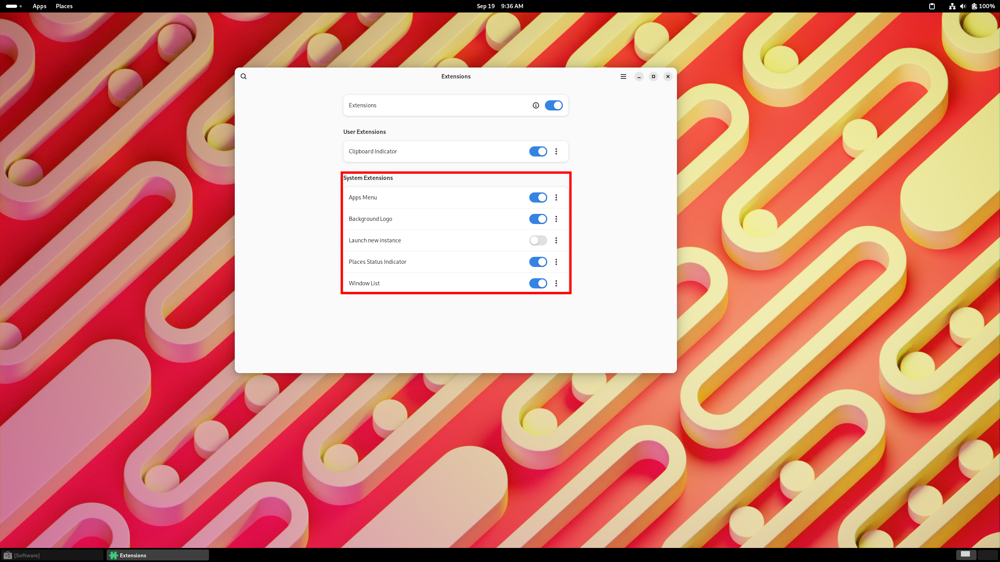

# Customisation

With the `Extensions` app open, you may now customise the desktop settings with the toggle buttons. 

**TODO:  We reccommend toggling `App Menu`, `Places Status Indicator`, and `Windows List`**
 

You should now see a taskbar across the bottom of the desktop, and two new buttons on the top bar named `Apps` and `Places`.
 

Selecting the `Apps` option opens a menu which contains recent and favourited applications, alongside a list of categories which all of the installed applications are split amongst.

**TODO:  Select the `Apps` button and inspect the available options.**
 

The `Places` option provides a list of default file locations.

**TODO:  Select the `Places` button, then any of the options to open the `files` application in the location of the option selected.**
 

To enable the maximisation or minimisation of windows, the `Tweaks` application is required. This also allows the customisation of other system settings such as system sounds, fonts, and startup applications.
